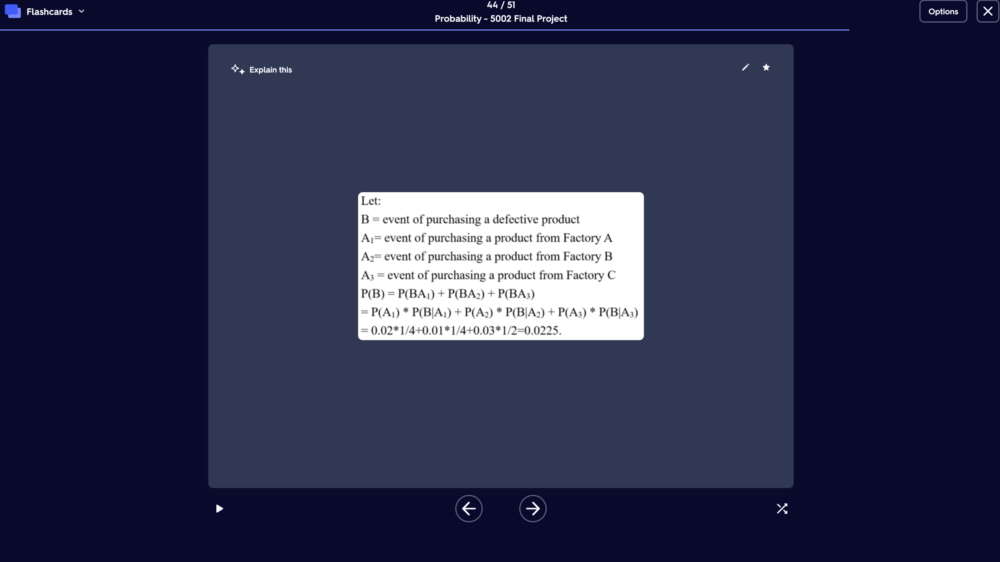
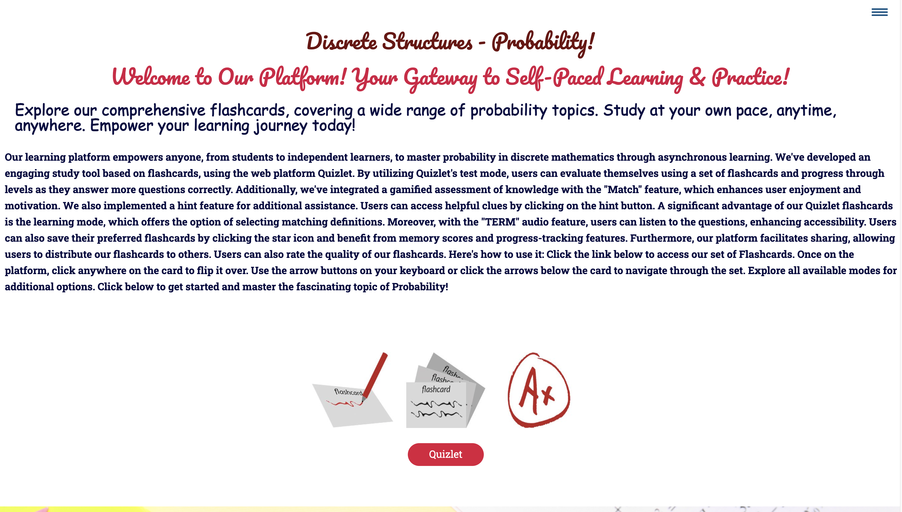
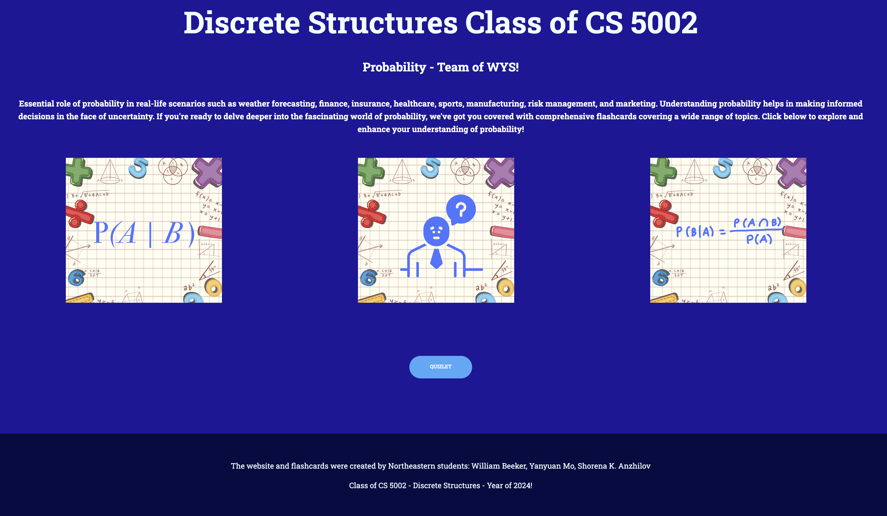

##  Class of CS 5002 Discrete Structures - Topic of Probability!
## Final Project "Deck of Flashcards" Ceated by Team of WYS. 

### Final Project Description:
#### We've developed an engaging study tool based on deck of Flashcards, using the web platform Quizlet. Our learning platform empowers anyone, from students to independent learners, to master probability in discrete mathematics through asynchronous learning. By utilizing Quizlet's test mode, users can evaluate themselves using a set of flashcards and progress through levels as they answer more questions correctly. Additionally, we've integrated a gamified assessment of knowledge with the "Match" feature, which enhances user enjoyment and motivation. We also implemented a hint feature for additional assistance. Users can access helpful clues by clicking on the hint button. A significant advantage of our Quizlet flashcards is the learning mode, which offers the option of selecting matching definitions. Moreover, with the "TERM" audio feature, users can listen to the questions,for enhancing accessibility. Users can also save their preferred flashcards by clicking the star icon and benefit from memory scores and progress-tracking features. Furthermore, our platform facilitates sharing allowing users to distribute our quizlet  deck of flashcards link to others. Users can also rate the quality of our paltform. 

## Preview 

## Go to Flashcard - App:
[CLICK HERE!](https://quizlet.com/898347569/probability-cs-5002-final-project-flash-cards/)

## We have also created static website to showcase our Quizlet Flashcards. 

## Technologies Implemented - Tech Stack:
 - HTML
 - CSS
 - JavaScript
 - Deployed on gitHub 

Description:
 Our static Website is dedicated to explaining the content of the a deck of flashcards that we've created on Quizlet. Our goal is to provide users with a clear understanding of the topics covered in our flashcards deck and facilitate easy navigation to the link. We've included direct links to our Quizlet flashcards on our website, allowing users to seamlessly access additional study materials and useful features. Whether you're a student preparing for exam or someone looking to expand your knowledge, we encourage you to utilize our website. Webpage is hosted on GitHub, ensuring reliability and accessibility for users worldwide. Whether you're studying at home, in the library, or on the go, our website is accessible anytime, anywhere.

## Preview 
# About page.

## Link page.

## Footer page. 

## Link to hosted application:
[CLICK HERE!](https://shorenak.github.io/FlashCardsProbability/)

## Resources:
- 1. [Quizlet](https://quizlet.com/login?redir=https%3A%2F%2Fquizlet.com%2Flatest)

## Developer:
- [Yanyuan Mo](https://github.com/yanyuanmo)
- [William Beeker](https://github.com/wbeeker)
- [Shorena K. Anzhilov](https://github.com/ShorenaK)

## Support: 
 If you have any concerns or questions, you are welcome to reach out via email at: probabilityflashcards_cs5002@gmail.com 